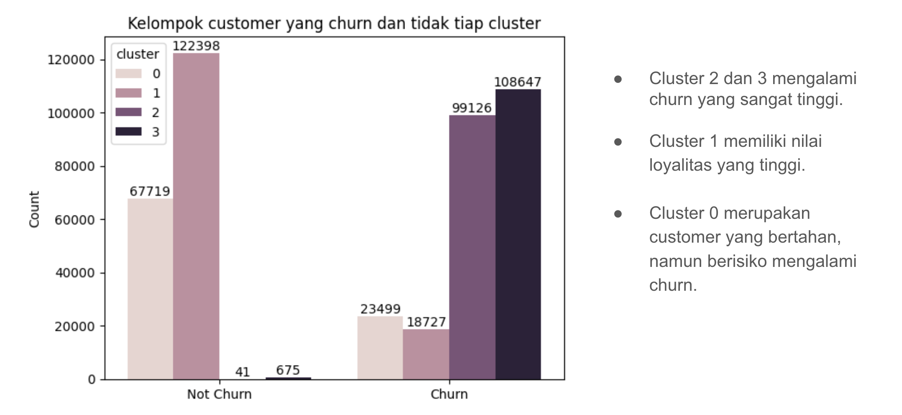
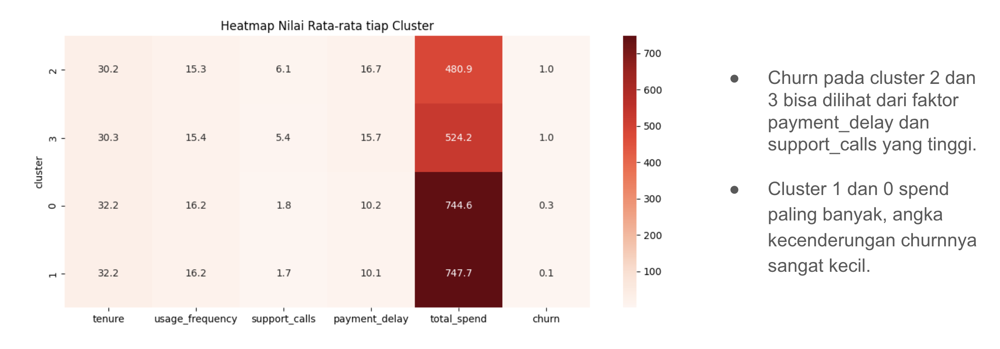
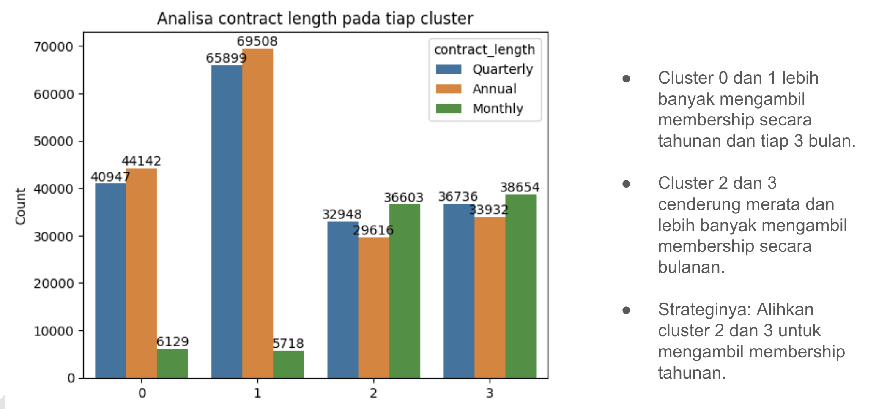
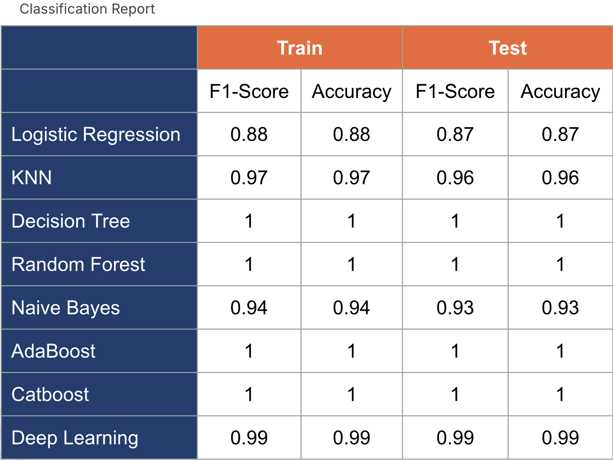
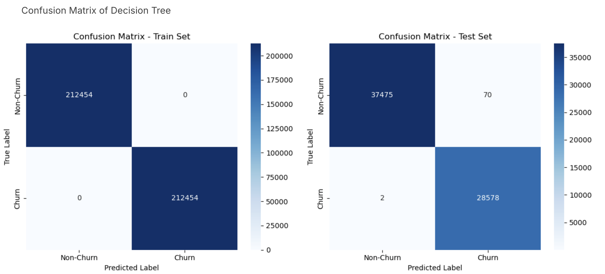
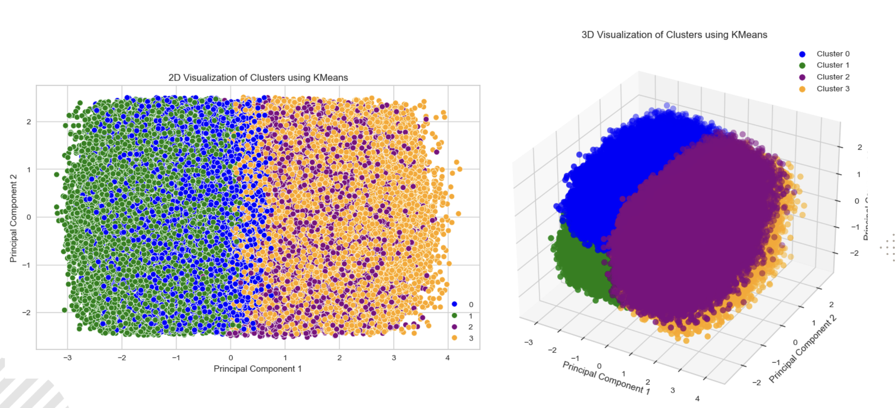

<!--  -->

  

<h1 align="center">Locana</h1>
<h3 align="center">Melihat Churn, Mengunci Kesetiaan</h3>

Proyek kami fokus pada memprediksi churn pelanggan untuk membantu bisnis mempertahankan pelanggan yang paling berharga.\
**Locana** dibuat menggunakan machine learning untuk memprediksi churn terhadap membership berbayar di e-commerce serta  mengidentifikasi segmentasi membership dan rekomendasi terhadap segmentasi tersebut.

---

## Latar Belakang
Berdasarkan publikasi statistik dari Kementerian Perdagangan tentang PERDAGANGAN DIGITAL (E-COMMERCE) 
INDONESIA PERIODE 2023, menyatakan bahwa e-commerce di Indonesia telah mengalami pertumbuhan yang 
signifikan dari 2019 hingga 2023, e-commerce menghadapi tantangan besar, salah satunya adalah `churn pelanggan`

---

## Objektif
Membuat model prediksi dan model clustering yang bertujuan untuk memprediksi churn dan memberikan rekomendasi untuk membantu perusahaan _e-commerce_ dalam mempertahankan pelanggan dan mengurangi risiko kehilangan pangsa pasar.

---

## Tools
- Python
- Apache Airflow
- PostgreSQL
- Visual Studio Code
- Pandas
- Numpy
- Matplotlib
- Seaborn
- Tableau
- Scikit-learn
- Tensorflow
- Keras
- Streamlit

---

## Eksplorasi Data Analisis

---

## Hasil

  

---

## Kesimpulan
- Model prediksi yang telah dibangun menggunakan algoritma Decision Tree berhasil mencapai akurasi yang tinggi yaitu 99%. Hal ini menunjukan bahwa model efektif dalam memprediksi apakah customer akan churn atau tetap loyal.

- Model clustering berhasil membagi customer menjadi 4 kategori dengan karakteristik yang cukup jelas.
- **Monthly Spender**: Customer yang memiliki daya beli yang tinggi dan rutin tiap bulannya. Pola belanja customer pada kelompok Monthly Spender umumnya adalah untuk belanja bulanan. Monthly Spender yang loyal merupakan customer yang rutin berbelanja, hemat dan efisien.
- **Frequent Spender**: Customer yang memiliki daya beli yang tinggi dan rutin tiap minggunya. Pola belanja customer pada kelompok Frequent Spender umumnya adalah untuk belanja mingguan. Frequent Spender yang loyal merupakan customer yang sering berbelanja dan efisien.
- **Young Risk**: Customer dengan rentang usia 18-49 tahun dan memiliki daya beli yang cukup. Pola belanja customer pada kelompok Young Risk umumnya adalah untuk belanja tiap 2 minggu. Young Risk yang loyal merupakan customer muda remaja hingga dewasa yang rutin berbelanja dan sedikit keluhan.
- **Elder Risk**: Customer dengan rentang usia 49-65 tahun dan memiliki daya beli yang cukup. Pola belanja customer pada kelompok Older Risk umumnya adalah untuk belanja tiap 2 minggu. Older Risk yang loyal merupakan customer dewasa hingga lansia yang rutin berbelanja dan sedikit keluhan.

---

## Tim
- [**Astrila Ikhlasia Eprina**](https://www.linkedin.com/in/astrilalia/) (Data Analyst)
- [**Muhammad Azhar Khaira**](https://www.linkedin.com/in/azharkhaira/) (Data Scientist)
- [**Yuzal Qushoyyi Wahyudi**](https://www.linkedin.com/in/yuzalqushoyyiwahyudi/) (Data Engineer)
---

Deployment on [Hugging Face](https://huggingface.co/spaces/yuzalle/Locana)

---

## Referensi

- *Kotler, P., & Keller, K. L. (2016). Marketing Management (15th ed.). Pearson.*
- *Nguyen, B., & Mutum, D. S. (2012). A review of customer relationship management: Successes, advances, pitfalls and futures. Business Process Management Journal, 18(3), 400-419.*
- *Reichheld, F.F.; Sassser, W.E., Jr. Zero Defections: Quality Comes to Services. Harv. Busi. Rev.; 1990; 68, pp. 105-111.*
---
